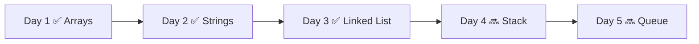
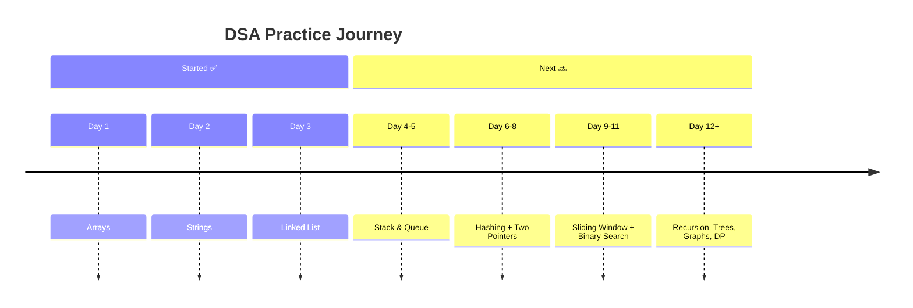
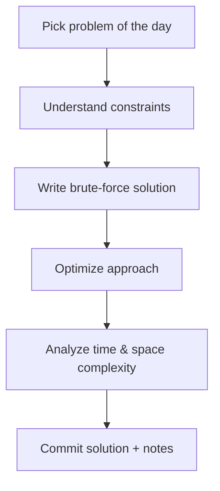

# LeetCode DSA Practice 🚀

Daily Data Structures & Algorithms practice through LeetCode problems.
This repository is focused on **consistency**, **pattern recognition**, and **clean solution writing**.

---

## ✨ Why this repository?

I’m building this repo to:
- 📅 Maintain a daily problem-solving habit
- 🧠 Strengthen core DSA fundamentals
- ⚡ Improve coding speed and interview readiness
- 📝 Keep readable, revisitable solutions with notes

---

## 🎯 Main Goals

- Solve at least **1 LeetCode problem per day**
- Cover essential DSA patterns progressively
- Practice both brute-force and optimized approaches
- Improve time and space complexity awareness

---

## 🧰 Tech Stack

- **Primary:** Python
- **Secondary (optional):** JavaScript

---

## 📈 Current Progress

- ✅ Day 1: Arrays
- ✅ Day 2: Strings
- ✅ Day 3: Linked List

### Progress Flow

---

## 🗺️ Learning Roadmap (What’s Coming)

The next topics I plan to focus on:

- 🔜 Stack & Queue
- 🔜 Hashing / Frequency Maps
- 🔜 Two Pointers & Sliding Window
- 🔜 Binary Search
- 🔜 Recursion & Backtracking
- 🔜 Trees & Graphs
- 🔜 Dynamic Programming (DP)

### Topic Timeline

---

## 🧪 Daily Practice Workflow

---

## 📌 Problem-Solving Checklist

Before moving to the next problem:
- [ ] I understood the input/output clearly
- [ ] I considered edge cases
- [ ] I compared brute-force vs optimized solution
- [ ] I recorded complexity analysis
- [ ] I can explain the solution in simple terms

---

## 🤝 Contribution / Follow Along

If you want to follow the journey:
- ⭐ Star the repo
- 🍴 Fork and solve along daily
- 💬 Open discussions on alternative approaches

---

## 🏁 Long-Term Outcome

By staying consistent, this repo should become:
- A complete DSA revision notebook
- An interview preparation tracker
- A proof of disciplined daily coding practice 💪